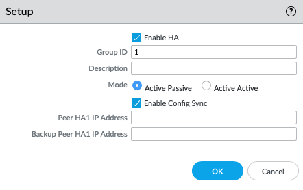

# Active/Passive
## TLDR
The criteria that must be matched for two firewalls to establish Active/Passive HA are:
1. Firewall Model
2. PAN-OS Version
3. Multi-VSYS capability 
    - You can't do HA between a Multi-VSYS device and a non-Multi-VSYS device, even if multiple VSYS are not configured.
4. Same interface types configured for HA links
    - You can't use dedicated HA interfaces on one device and data interfaces on the other
5. Licenses
6. Additional considerations for firewalls managed by Strata Cloud Manager:
    - Both devices must be in the same folder
    - All HA IP addresses must be IPv4
    - Multi-VSYS is disabled

## Mode Overview
Active/Passive is the traditional mode for HA firewalls. One devices is active and passing all traffic, while the other waits in reserve. If the active firewall fails or detects a failure, the firewalls will *failover*. The Active firewall will move to an inactive state, and the Passive firewall will become Active. The specifics of the configuration will determine when and how quickly this failover happens (see below). Active/Passive supports L2, L3, and virtual wire deployments.

Config Sync is an option that should almost always be turned on during HA configuration. This ensures that the two firewalls are syncing their configuration between devices. Generally this is only disabled while resolving a failover incident, to ensure that any configuration changes made are not synced until the issue is resolved. You can compare the differences between each device in the pair in the Config Audit menu. Configuration can be manually synced from the **Dashboard**.

## States
1. **Active** - Firewall is live and currently passing traffic
2. **Passive** - Firewall is ready and waiting in case the Active firewall fails
3. **Non-functional** - Firewall is down for some error or is recovering from that error. This can be a device  or monitored object failure, or a configuration mis-match.
4. **Suspended** - HA has been disabled on the firewall to prevent configuration sync or failover. It still participates in all the HA communication, but will not move to an Active state without being enabled by a user.

## Configuration and Settings
Basic High-Availability on a Palo Alto firewall is very simple. Connect a cable, configure the interface, enable the setting and configure a group and you're good to go. However, there are some nuances that can have a significant impact on your actual resiliency. Let's go through the full process and talk about each step.

> #### Just Get it Running
> The configuration for HA on a firewall is located in **Device > High Availability**. These are the only settings you need to configure to get HA up > and running: 
> 
> - *Group ID*: An identifier to help the firewall match with the appropriate peer. If the group ID doesn't match between devices, they will not > establish HA.
> - *Peer HA1 IP Address*: The IP address configured on the HA1 interface of the <u>peer</u> device. 
> - *Backup Peer HA1 IP Address (optional)*: The IP address configured on the backup HA1 interface of the <u>peer</u> device.
> - Network connectivity between the HA1 interfaces on both devices.

Note that this is not the *recommended* way to set up HA, just the bare minimum of what is required.

## Other Settings
### Passive Link State
This determines what state the interfaces are on the passive firewall. By default this is *Shutdown*, but can be configured to *Auto*. Either way, the HA IP address will float between the Primary and secondary device, but the MAC address may change.

Shutdown is the simpler of the two, but it means a longer failover time, because the interfaces will have to come up before they can start passing traffic. The Primary and Secondary firewalls will have different MAC addresses, which means the ARP tables will need to be rebuilt on the firewall and its neighbors on failover. This usually doesn't take long (on the order of a few seconds rather than dozens), but if the firewall also has to re-establish dynamic routing and/or aggregate links it starts to add up pretty quickly. The advantage is that you cannot run into loops.

Auto means that the interfaces state will reflect the physical link state. For example, if the physical link is down, the interface will be down. If the physical link is up, the interface will be up. Either way, the Passive firewall will drop all packets received on data interfaces.
Corresponding interfaces on the firewall will be assigned a Virtual MAC that will be shared between devices. For example Ethernet1/1 on FW1 and Ethernet1/1 on FW2 will both have the same MAC. That way, neighboring devices do not need to re-learn the MAC address on failover.

The interfaces on the Passive device will not participate in ARP, and will not pass traffic. This is ideal when the firewall is all layer 3. If the firewall has any layer 2 interfaces, this can cause issues, because some switches will see that the interface is up and try to send some packets to that interface, which the firewall will drop. 

# References
1. [Passive Link Modes](https://knowledgebase.paloaltonetworks.com/KCSArticleDetail?id=kA10g000000ClcACAS)
2. [Preemption](https://knowledgebase.paloaltonetworks.com/KCSArticleDetail?id=kA10g000000ClWPCA0)
3. [Preemption Loops](https://knowledgebase.paloaltonetworks.com/articles/en_US/Knowledge/When-does-an-HA-node-go-into-S-67706)
4. [Heartbeat and Hellos](https://knowledgebase.paloaltonetworks.com/KCSArticleDetail?id=kA10g000000ClUcCAK)
5. [Suspended state](https://knowledgebase.paloaltonetworks.com/KCSArticleDetail?id=kA10g000000ClgVCAS)