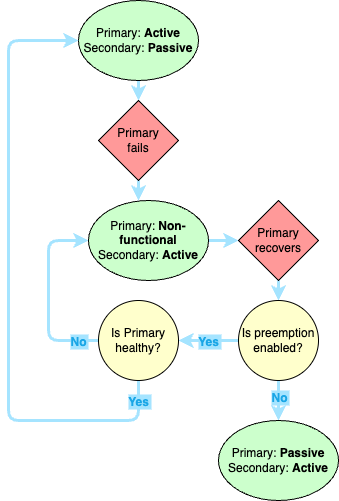
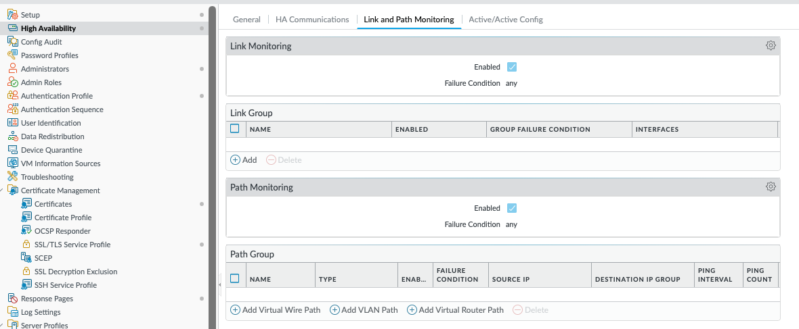

## HA Overview
High-availability (HA) in firewalls is a massive topic that is easy to grasp at a high-level, but the details have a surprising amount of nuance. It's not the kind of nuance you want to be dealing with at 3 AM, so it's worth taking a little more time to discuss. Because of that, this post will be split into four parts: one for the concepts, and one for each of the three major HA modes.

### Concepts
1. **Active** - The firewall(s) currently passing traffic for the network. 
2. **Passive** - The firewall not passing traffic, held in reserve in case the Primary fails. This role is not present in Active/Active or Clustering configurations, where all devices are passing traffic. 
3. **Primary Firewall** - This is the *preferred* firewall. It does *not* have to be the device passing traffic, but it will be treated as the source of truth from a configuration perspective and will generally be the active device when the environment is healthy.
4. **Secondary Firewall** - This is the *backup* firewall. It can be Active, but will generally fail back to the Primary once it recovers from whatever error caused it to fail, depending on pre-emption settings. 

Any firewall will have 2 of these roles at any given time. It could be Active/Primary, Active/Secondary, Passive/Primary, or Passive/Secondary. Active/Passive describes the state of the firewall, while Primary/Secondary is an administrative designation. These generally align to the different HA states described in the different HA modes below.

#### Configuration Sync
Generally speaking, all configuration is synced from one peer to another. However, this doesn't include everything. For example, it would be silly if the HA1 interface IP address was synced between firewalls. These are mostly settings that require references to IP addresses specific to one firewall or the other (e.g. management interfaces, or HA). A full list can be found [here](https://docs.paloaltonetworks.com/ngfw/administration/high-availability/reference-ha-synchronization).

## Link Types
Before we get too far into the different types of HA, let's talk about the different HA link types. Most firewall models will have dedicated HA interfaces, the VM series being a notable exception (virtual HA links must be manually configured as HA)
1. **HA1** - AKA, the *Control Link*. This link handles all the logistics of the HA connection, such as heartbeat, state information, management plane synchronization, and User ID (if needed). When a device changes HA state, that information is communicated or detected across the HA1 link. HA1 is a Layer 3 link and requires an IP address. This traffic is not encrypted by default so if the two firewalls are not directly connected, be sure to enable encryption on this link.
2. **HA2** - AKA, the *Data Link*. This link (if configured), carries information about traffic flows from the Active (or Primary) firewall to the Passive (or Secondary) firewall. HA2 is a Layer 2 link that carries information about:
  - Established sessions
  - Forwarding tables
  - ARP tables
  - Security Associations for VPN tunnels
If HA2 is not configured, session data will not be synchronized and existing sessions will drop and need to be re-established during failover, which will lead to longer failover times and potential application disruption. 
3. **HA3** - AKA *Packet Forwarding Link*. This is only used in Active/Active configurations and is used to send packets back and forth during session creation and to handle asymmetric traffic. For example, if FW1 owns a particular session, and FW2 receives a packet for that session, FW2 will send that packet to FW1 on HA3 for appropriate routing. HA3 is a Layer 2 link that does not support encryption, so avoid connecting HA3 to anything but the paired firewall whenever possible.
4. **HA4** - HA4 is only for clusters, and is used to perform session cache synchronization among the clustered devices. It is also a Layer 2 link. 
5. **Backup Links** - HA1, HA2, and HA4 all support backup links that can be used for redundancy if one fails. These are generally unused data interfaces on the firewall that are configured as *HA type* interfaces. HA3 does not support backup links. 
[This page](https://docs.paloaltonetworks.com/ngfw/administration/high-availability/ha-ports-on-palo-alto-networks-firewalls) can provide more information about which ports can be used for which links on the different hardware models. 

## Modes
High-Availability is broadly any mechanism used to increase the availability of the firewall after a failure. For the purposes of this exam, it involves using multiple firewalls to handle traffic, so that if one goes down, there's still a functioning device to protect the network. Strategies to accomplish this vary depending on the architecture, especially between cloud and on-premesis infrastructure. The different modes that can be used to accomplish this are:
1. [*Active/Passive*](3-ngfw-e-ha-ap) - 2 devices. One device is handling all traffic, while the other waits in reserve
2. [*Active/Active*](3-ngfw-e-ha-aa) - 2 devices. Both devices are handling traffic, with sessions split between the two devices
3. [*Clustering*](3-ngfw-e-ha-c) - 2 or more devices (depending on hardware, it could be up to 16). All devices are active, and sessions are synchronized across all devices in the cluster.

For cloud environments, clustering is not supported. High-Availability in the cloud is usually handled with auto-scaling and/or load balancers before and after the firewall(s). See Palo Alto's [Reference Architectures](https://www.paloaltonetworks.com/resources/reference-architectures) for more information on your specific scenario.

## Other considerations
PAN-OS versions, as well as dynamic content versions (App-ID, Threat-ID, etc.) should be the same. If the OS version doesn't match, HA will not establish. If the content versions don't match, there could be a synchronization issue.

## General HA Settings
The settings below apply to both Active/Passive and Active/Active. For clarity, I'm going to use FW1 and FW2. For Active/Passive, FW1 will be Active and FW2 will be Passive. For Active/Active, FW1 will be Active-Primary and FW2 will be Active-Secondary.
### Election Settings
One of the most important areas of configuration for HA is the Election settings. This determines when exactly the firewall will determine that a device has failed and initiate failover. This is configured under **Device > High Availability > General > Election Settings**.

#### Preemption
Preemption determines whether FW1 will take back over from the FW2 after a failover once it recovers. For example, if the FW1 reboots unexpectedly FW2 takes over. Once FW1 comes back up, if preemption is enabled, it will take over the active role from FW2 again if it is in a healthy state.

Preemption generally isn't recommended for two reasons. First, failovers involve downtime. If preemption is enabled, you risk taking an unneccessary downtime just to failover between two healthy devices. In some cases, this could lead to a Preemption Loop, where the firewalls continually fail back and forth until the [Flap Max](#Flap-Max) Second, if a device fails, you should usually investigate the cause of the failure before allowing it to start passing traffic again.

#### High-Availibility Timers
All times are configured in milliseconds unless otherwise specified.
1. *Heartbeat Backup* - Enabling this means the firewall will use the Management Interface as a backup to send HA Heartbeats to its peer. Don't configure this if you're using the Management interface as the HA1 Backup interface.
2. *Promotion Hold Time* - The amount of time the passive device will wait before taking over from a failed peer.
3. *Hello Interval* - The amount of time between hello packets sent between firewalls to verify HA status and provide configuration sync status. This is a TCP connection, but no response is sent by the receiving firewall. 
4. *Heartbeat Interval* - The amout of time between ICMP heartbeats. These heartbeats only check network connectivity to the peer.
5. *Preemption Hold Time* - Minutes. How long the passive firewall will wait before triggering preemptive failover. This timer starts when the passive device has a lower priority value than the active device.
6. *Monitor Fail Hold Up Time* - How long the firewall will stay active after a Link or Path monitoring failure is detected. 
7. *Additional Master Hold Up Time* - Time added onto the *Monitor Fail Hold Up Time* for the Active firewall to see if FW1 and FW2 are both detecting the same monitor failure. This can help avoid a situation where the firewall fails over to a device that is also experiencing issues. 
8. *Monitor Fail Hold Down Time (Active/Passive Only)* - Minutes. This is how long a device will remain Suspended before returning to a Passive state. This is generally triggered by a Link or Path Monitoring failure.

#### Flap Max
 This setting governs how many times a device can failover before entering a Suspended state. Any time a firewall enters a Non-functional state within 15 minutes of the last time it became Non-functional, this counter is incremented and it is cleared after 10-20 minutes with no failures. This setting ensures that the firewalls are not endlessly failing back and forth leading to future disruptions. 

## Optimization
### LACP and LLDP
LACP and LLDP are link negotiation protocols for aggregated or individual interfaces that allow the firewall to pre-negotiate connections on the Passive device. This is what allows for sub-second failovers. LACP governs the Aggregate Ethernet connection and is only available for L2 or L3 interface types. LLDP is available on L2, L3, or Virtual Wire interfaces.

If you're using LACP and/or LLDP, each firewall will have its own MAC address, and you cannot enable the Virtual MAC address defined above. However, that's okay, because FW2 will pre-negotiate connections to the adjacent devices before a failover happens.

LLDP and LACP can be configured in either Active or Passive mode. The full table of scenarios can be found [here](https://docs.paloaltonetworks.com/ngfw/administration/high-availability/set-up-activepassive-ha#id8e4cc79e-3c5d-4b8e-bea2-c6d4acdffebf_section-efr_vls_hgc), but in general:
1. Ethernet interfaces support:
    - LLDP for L2, L3, or Vwire interfaces
    - LACP for Vwire interfaces in passive mode only
2. Aggregate Ethernet interfaces support:
    - LLDP for L2, L3, or Vwire interfaces
    - LACP for L2 or L3 interfaces

### Link and Path Monitoring
Link and Path monitoring are used to define failover conditions for a firewall. These are critical. By default, the firewall will only failover if it has a hardware or software failure like a reboot. Imagine a scenario where you have a switch on the LAN side of your firewall. A failure on that switch will not necessarily trigger a failover. Another example would be if the WAN link to your ISP's router comes unplugged. By default, that would not trigger a failover, even if FW2 had a valid connection to that device. All settings for this are configured under **Device > High-Availability > Link and Path Monitoring**.

#### Link Monitoring
Link monitoring provides a mechanism for firewalls to monitor the health of the links connected to their interfaces and trigger a failover if an interface or group of interfaces goes down. This is done by configuring one or more *Link Groups* and setting the failover criteria. Each Link Group has the following:
1. Name
2. Enabled/Disabled setting - Whether monitoring for this group is enabled or not
3. Group Failure condition - When will the Group report a *Failure*. Can be if any of the grouped interfaces fail, or can require all grouped interfaces to fail before the condition is triggered
4. Interfaces - Interfaces being monitored under this condition

In addition, Link Monitoring has a general Enabled/Disabled toggle, and an overall Failure Condition. Each group only reports whether or not the group has failed. It does not trigger failover by itself. The failover trigger happens at the higher level, which defines whether a failover will happen if *any* Link Group fails, or if *all* Link Groups have to fail before the failover event happens.

#### Path Monitoring
Path monitoring is very similar to Link Monitoring, except it monitors network connectivity to an IP or group of IPs. Similar to Link Grouping, each Path Group will define one or more IP addresses that should be reachable from a particular soruce IP on the firewall. There is also an overall setting that determines when the failover event actually occurs. 

There are a few settings here that don't exist for Link Monitoring. You need to specify a source IP address, how often the monitored IPs are pinged, and how many ping failures must occur before the group fails.

## NGFW in the Public Cloud
High Availability works quite differently due to the difference in architecture in the various Public Clouds. Palo Alto firewalls currently support the follow Cloud HA scenarios:
1. *Active/Passive* - AWS and Azure only
    - In AWS, NGFW HA is not supported when Elastic Load Balancing (ELB) is deployed. ELB 
2. *Active/Active* - Not supported

## References
1. [HA General Info](https://docs.paloaltonetworks.com/ngfw/administration/high-availability)
2. [Failover Triggers](https://docs.paloaltonetworks.com/ngfw/administration/high-availability/failover)
3. [Timers](https://docs.paloaltonetworks.com/ngfw/administration/high-availability/ha-timers)
4. [Link and Path Monitoring](https://docs.paloaltonetworks.com/ngfw/administration/high-availability/set-up-activepassive-ha/define-ha-failover-conditions)